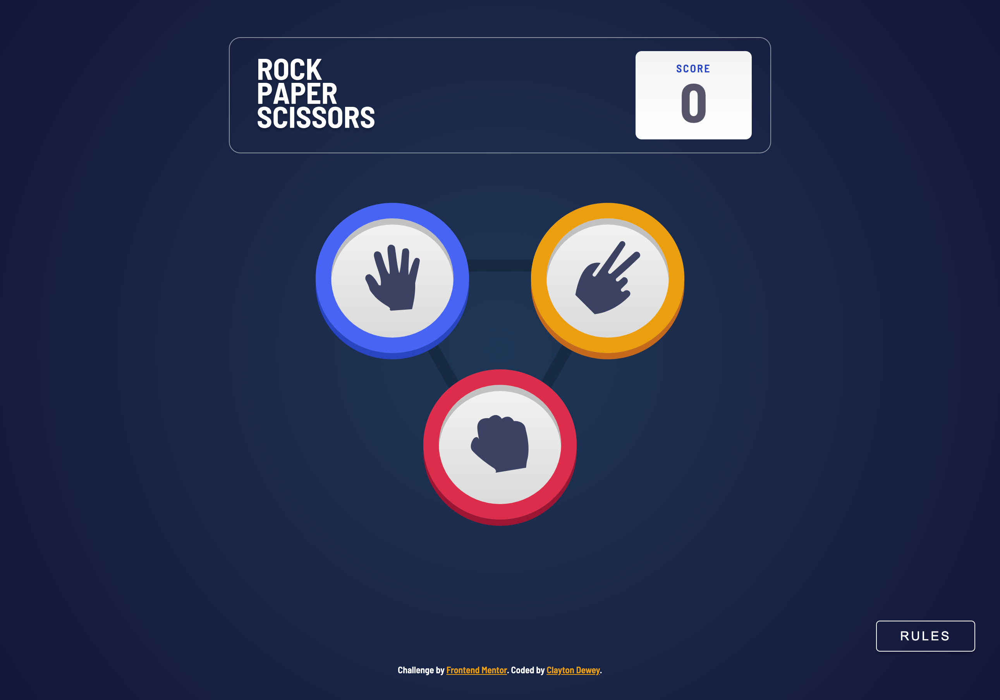

# Frontend Mentor - Rock, Paper, Scissors solution

This is a solution to the [Rock, Paper, Scissors challenge on Frontend Mentor](https://www.frontendmentor.io/challenges/rock-paper-scissors-game-pTgwgvgH). Frontend Mentor challenges help you improve your coding skills by building realistic projects.

## Table of contents

- [Overview](#overview)
  - [The challenge](#the-challenge)
  - [Screenshot](#screenshot)
  - [Links](#links)
- [My process](#my-process)
  - [Built with](#built-with)
  - [Continued development](#continued-development)
- [Author](#author)

**Note: Delete this note and update the table of contents based on what sections you keep.**

## Overview

### The challenge

Users should be able to:

- View the optimal layout for the game depending on their device's screen size
- Play Rock, Paper, Scissors against the computer
- Maintain the state of the score after refreshing the browser _(optional)_
- **Bonus**: Play Rock, Paper, Scissors, Lizard, Spock against the computer _(optional)_

### Screenshot

### Links

- Solution URL: [github.com/ClaytonDewey/fem-rock-paper-scissors](https://github.com/ClaytonDewey/fem-rock-paper-scissors)
- Live Site URL: [claytondewey.github.io/fem-rock-paper-scissors/](https://claytondewey.github.io/fem-rock-paper-scissors/)

## My process

### Built with

- Semantic HTML5 markup
- CSS custom properties
- Flexbox
- Mobile-first workflow
- [React](https://reactjs.org/) - JS library
- [Zustand](https://zustand.docs.pmnd.rs/getting-started/introduction) - State Management

### Continued development

I plan on eventually refactoring and adding an advanced mode toggle that would allow player to play Rock, Paper, Scissors, Lizard, Spock.

## Author

- Website - [Clayton Dewey](https://www.claytondewey.com)
- Frontend Mentor - [@ClaytonDewey](https://www.frontendmentor.io/profile/ClaytonDewey)

**Note: Delete this note and add/remove/edit lines above based on what links you'd like to share.**
